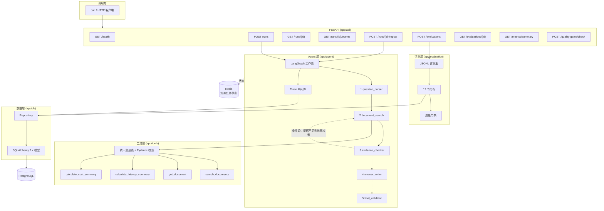

# AgentTrace

**记录、回放、评测和分析 LLM Agent 的执行过程。**

> **本项目为个人独立开发项目。** 不使用任何公司代码、公司数据、公司接口或未公开业务信息。
> 所有演示数据均为项目自建的公开/合成数据。项目内所有指标均来自**离线评测**或**样例运行**，
> **不代表任何线上流量、生产环境表现、用户量、客户数或商业收益**。

## 这个项目解决什么问题

一次 Agent 运行跑完之后，你通常只拿到一个最终答案。但你回答不了这些问题：

- 它经过哪几个节点？每个节点花了多久？
- 它调用了哪些工具？工具选对了吗？参数传对了吗？
- 失败发生在哪一步？错误码是什么？
- 这次 Token 花了多少？成本多少？
- 我把 Prompt 改了一版，到底是变好了还是变差了？

AgentTrace 把这些问题变成**可查询、可回放、可量化、可设门禁**的工程能力。

## 架构



Agent 工作流细节见 [`docs/diagrams/agent_flow.mmd`](docs/diagrams/agent_flow.mmd)，
评测流程见 [`docs/diagrams/eval_flow.mmd`](docs/diagrams/eval_flow.mmd)。

## 技术选型

| 项 | 选择 | 说明 |
|---|---|---|
| Python | 3.12 | |
| HTTP | FastAPI | |
| Agent | LangGraph | 固定 5 节点 + 条件边，**图定义了工具调用的允许范围**，这是评测"工具选择"的前提 |
| 契约 | Pydantic v2 | 配置、事件、工具参数、评测结果 |
| ORM | **SQLAlchemy 2.x**（非 SQLModel） | 需显式控制索引、约束与事务时机；理由见 `docs/PROJECT_SPEC.md` §T7 |
| 数据库 | PostgreSQL 16 | 测试可切 SQLite |
| 缓存 | Redis 7 | **只存短期任务状态，不缓存最终答案** |
| 测试 | pytest | 默认不需要网络与 API Key |

## 快速开始

### 方式一：Docker Compose（推荐）

```bash
git clone <your-repo-url> agenttrace && cd agenttrace
cp .env.example .env

docker compose up -d --build
docker compose ps          # 等待 api 变成 healthy

curl -s http://localhost:8000/health
```

打开 <http://localhost:8000/docs> 查看交互式 API 文档。

### 方式二：本地开发

```bash
python -m venv .venv
source .venv/bin/activate          # Windows: .venv\Scripts\activate
pip install -r requirements.txt

cp .env.example .env

# 启动依赖（只用容器跑 PG 和 Redis，应用本地跑便于调试）
docker compose up -d postgres redis

python scripts/init_db.py
python scripts/seed_data.py

uvicorn app.main:app --reload --port 8000
```

> **不需要 API Key 即可完整跑通。** 默认 `LLM_PROVIDER=fake` 使用本地测试替身，
> 不进行任何网络调用。

## 样例命令

```bash
# 运行一次 Agent
curl -s -X POST http://localhost:8000/runs \
  -H "Content-Type: application/json" \
  -d '{"question":"AgentTrace 如何记录一次工具调用？","top_k":3}'

# 查询这次运行（含全部 Trace 事件）
curl -s "http://localhost:8000/runs/<run_id>?include_events=true"

# 只看节点事件
curl -s "http://localhost:8000/runs/<run_id>/events?event_type=node"

# 只看失败与重试
curl -s "http://localhost:8000/runs/<run_id>/events?status=failed,retried"

# 回放（换一版 Prompt，生成新 run_id，保留 source_run_id）
curl -s -X POST "http://localhost:8000/runs/<run_id>/replay" \
  -H "Content-Type: application/json" \
  -d '{"prompt_version":"prompt-v2","note":"对比 prompt-v2"}'

# 跑一次离线评测
curl -s -X POST http://localhost:8000/evaluations \
  -H "Content-Type: application/json" \
  -d '{"dataset_version":"doc_research_v1","agent_version":"v1"}'

# 看评测里失败的 case 及原因
curl -s "http://localhost:8000/evaluations/<evaluation_id>?include_cases=true&only_failures=true"

# 指标汇总（按 Agent 版本分组对比）
curl -s "http://localhost:8000/metrics/summary?group_by=agent_version"

# 质量门禁：指标低于阈值则阻断
curl -s -X POST http://localhost:8000/quality-gates/check \
  -H "Content-Type: application/json" \
  -d '{"evaluation_id":"<evaluation_id>","gate_name":"release-gate"}'
```

## 测试

```bash
# 全部测试（默认不需要网络与 API Key）
python -m pytest tests -q

# 只跑纯逻辑测试（无 IO）
python -m pytest tests/unit -q

# 接口测试 / 冒烟测试
python -m pytest tests/api tests/smoke -q

# Lint
ruff check .
ruff format --check .

# 契约一致性校验（代码 ↔ 设计文档）
python scripts/verify_contract.py

# 需要真实 PostgreSQL / Redis 的集成测试（默认跳过）
python -m pytest tests/integration -q

# 需要真实 LLM 的集成测试（默认跳过，需自行配置密钥）
ENABLE_REAL_LLM_TESTS=true LLM_PROVIDER=openai LLM_API_KEY=sk-... \
  python -m pytest tests/integration -q -m real_llm
```

### 测试替身与真实调用的边界（重要）

本项目**严格区分**两种情况，请在解读结果时务必注意：

| | 离线替身模式（默认） | 真实模型集成模式 |
|---|---|---|
| `LLM_PROVIDER` | `fake` | `openai` / `ollama` |
| 访问网络 | **否** | 是 |
| 需要 API Key | **否** | 是 |
| API 响应中 `is_test_double` | `true` | `false` |
| 能证明什么 | **流程与逻辑正确性** | 真实模型行为 |
| 不能证明什么 | 模型能力、线上效果 | — |

替身模式跑出的 `task_completion_rate` **不能**用来描述 Agent 的"智能程度"，
它只说明管道是否通畅。详见 [`docs/EVALUATION.md`](docs/EVALUATION.md) §7。

## 评测

```bash
# 跑评测集并执行质量门禁
python scripts/run_eval.py --dataset doc_research_v1 --gate
echo "退出码: $?"

# 退出码语义：
#   0 = 评测完成且门禁通过
#   1 = 评测完成但门禁未通过（阻断）
#   2 = 评测执行本身出错
```

评测指标共 12 个：`run_success_rate`、`task_completion_rate`、`tool_selection_accuracy`、
`tool_argument_accuracy`、`evidence_coverage`、`latency_ms_p50`、`latency_ms_p95`、
`latency_ms_mean`、`total_tokens`、`estimated_cost_usd`、`error_rate`、`human_review_rate`。

**每个指标的计算公式、数据来源与适用范围**都写在
[`docs/EVALUATION.md`](docs/EVALUATION.md) §3，包括分母定义、边界条件与反模式清单。

## 文档索引

| 文档 | 内容 |
|---|---|
| [`docs/PROJECT_SPEC.md`](docs/PROJECT_SPEC.md) | 项目契约：边界、节点、工具、数据模型、交付物 |
| [`docs/ARCHITECTURE.md`](docs/ARCHITECTURE.md) | 架构、分层规则、时序、错误模型、配置 |
| [`docs/DATA_MODEL.md`](docs/DATA_MODEL.md) | 8 张表的字段级定义、关系、ID 规则 |
| [`docs/TRACE_SCHEMA.md`](docs/TRACE_SCHEMA.md) | 6 类事件、12 个必需字段、状态语义、脱敏规则 |
| [`docs/API_CONTRACT.md`](docs/API_CONTRACT.md) | 10 个端点的完整请求/响应契约 |
| [`docs/EVALUATION.md`](docs/EVALUATION.md) | 指标公式、断言、门禁、替身边界、反模式 |
| [`docs/IMPLEMENTATION_PLAN.md`](docs/IMPLEMENTATION_PLAN.md) | 8 阶段实施计划与风险清单 |
| [`docs/ACCEPTANCE_CHECKLIST.md`](docs/ACCEPTANCE_CHECKLIST.md) | 验收清单（含类别与验证方式） |
| [`SECURITY.md`](SECURITY.md) | 密钥、日志、数据边界与威胁模型 |
| [`CONTRIBUTING.md`](CONTRIBUTING.md) | 贡献说明 |

## 已知限制

如实列出，避免误读：

1. **没有生产环境部署验证。** Docker Compose 面向本地开发与演示，不是生产部署方案。
2. **没有鉴权与多租户。** API 无认证，仅适用于本机或受信内网。
3. **评测指标全部来自离线评测或样例运行。** 项目内不存在也无法产生线上指标。
4. **样例文档是项目自建合成数据**，只有 6 篇，检索质量不代表真实文档库。
5. **默认测试使用测试替身**（`FakeLLMProvider`），不连接真实 LLM。
6. **成本是估算值。** 基于硬编码价目表，会过时，且不等于真实账单（不含缓存折扣、阶梯价）。
7. **SQLite 模式仅用于测试**，不支持并发写入；生产语义依赖 PostgreSQL。
8. **无数据库迁移工具。** 用 `init_db.py` 建表，字段变更需重建库；引入 Alembic 是后续工作。
9. **`POST /runs` 是同步执行**，最长等待 `AGENT_TIMEOUT_SECONDS`；未实现异步任务队列。
10. **人工接管（`handoff`）只记录状态**，没有接管 UI。
11. **无前端仪表盘**，只有 API 与 Swagger UI。
12. **检索是关键词匹配**，未使用向量检索或 embedding。

## 安全

- API Key **只从环境变量读取**，不入库、不进日志、不进响应（`/health` 只暴露是否已配置的布尔值）。
- 日志为结构化 JSON，写入前统一过脱敏（6 类敏感模式）。
- Trace 的输入输出摘要有限长截断，不存完整 Prompt 与完整模型响应。
- 详见 [`SECURITY.md`](SECURITY.md)。

## 开发工作流

本项目按 8 个阶段推进，每阶段一个 commit，每阶段都有可执行的验收命令：

```bash
# 契约一致性检查（会告诉你哪些阶段还没完成）
python scripts/verify_contract.py --verbose
```

阶段划分、每阶段允许修改的目录、验收命令见
[`docs/IMPLEMENTATION_PLAN.md`](docs/IMPLEMENTATION_PLAN.md)。

## License

[MIT](LICENSE)
