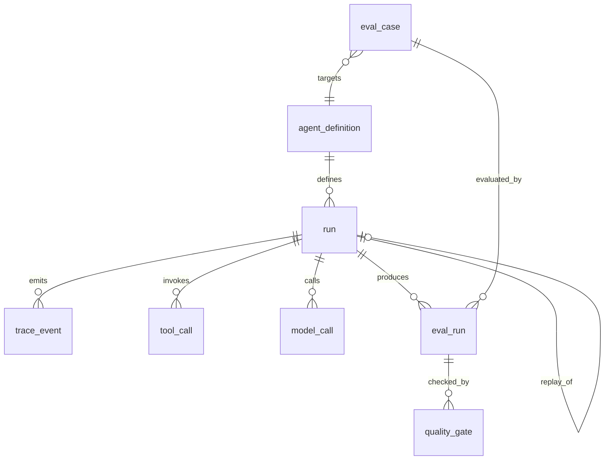

# DATA_MODEL.md — AgentTrace 数据模型

## 0. 总览

8 张表，全部使用 SQLAlchemy 2.x 声明式映射（`Mapped[...]` + `mapped_column`）。

## 1. 枚举约定

所有枚举以 `VARCHAR` 存储（不用数据库原生 ENUM，便于跨 SQLite/PostgreSQL 迁移），取值受 Python `StrEnum` 约束。

| 枚举 | 取值 |
|---|---|
| `RunStatus` | `pending` / `running` / `succeeded` / `failed` / `degraded` / `timeout` |
| `EventType` | `run` / `node` / `tool_call` / `model_call` / `error` / `final_result` |
| `EventStatus` | `pending` / `running` / `ok` / `failed` / `skipped` / `retried` / `invalid_arguments` / `handoff` |
| `ToolCallStatus` | `ok` / `error` / `invalid_arguments` / `timeout` / `skipped` |
| `ModelCallStatus` | `ok` / `error` / `timeout` |
| `EvalRunStatus` | `pending` / `running` / `succeeded` / `failed` |
| `GateStatus` | `passed` / `failed` |

`handoff` 是**人工接管**状态：节点判定无法自动完成后标记该状态并停止后续自动步骤。

## 2. 表结构

### 2.1 `agent_definition`

Agent 版本的定义，用于评测分组对比。

| 列 | 类型 | 约束 | 说明 |
|---|---|---|---|
| `id` | `VARCHAR(36)` | PK | `agentdef_<ulid>` |
| `name` | `VARCHAR(120)` | NOT NULL, UNIQUE | 如 `doc-research` |
| `agent_version` | `VARCHAR(40)` | NOT NULL | 如 `v1` |
| `prompt_version` | `VARCHAR(40)` | NOT NULL | 如 `prompt-v1` |
| `graph_definition` | `JSON` | NOT NULL | 节点列表与边（便于回溯工作流变更） |
| `description` | `TEXT` | NULL | 说明 |
| `created_at` | `TIMESTAMP(tz)` | NOT NULL | UTC |
| — | — | UNIQUE(`name`, `agent_version`, `prompt_version`) | 三元组唯一 |

### 2.2 `run`

一次 Agent 运行。

| 列 | 类型 | 约束 | 说明 |
|---|---|---|---|
| `id` | `VARCHAR(36)` | PK | `run_<ulid>` |
| `agent_definition_id` | `VARCHAR(36)` | FK → agent_definition.id, NULL | 可空，允许即席运行 |
| `source_run_id` | `VARCHAR(36)` | FK → run.id, NULL | **回放时指向原始 run**，非空表示这是一次回放 |
| `question` | `TEXT` | NOT NULL | 用户问题（原始） |
| `status` | `VARCHAR(20)` | NOT NULL, INDEX | `RunStatus` |
| `agent_version` | `VARCHAR(40)` | NOT NULL | 冗余存储，便于评测分组 |
| `prompt_version` | `VARCHAR(40)` | NOT NULL | 冗余存储 |
| `model_name` | `VARCHAR(80)` | NULL | 真实/替身模型名 |
| `llm_provider` | `VARCHAR(20)` | NOT NULL | `fake` / `openai` / `ollama` |
| `result_summary` | `JSON` | NULL | 最终答案摘要（不是完整答案） |
| `error_code` | `VARCHAR(60)` | NULL | 失败错误码 |
| `error_message` | `TEXT` | NULL | 失败信息（已脱敏、已截断） |
| `total_duration_ms` | `INTEGER` | NULL | 全流程耗时 |
| `total_tokens` | `INTEGER` | NOT NULL, DEFAULT 0 | 输入+输出 Token |
| `estimated_cost_usd` | `NUMERIC(12,6)` | NOT NULL, DEFAULT 0 | 由确定性代码计算 |
| `started_at` | `TIMESTAMP(tz)` | NOT NULL, INDEX | UTC |
| `ended_at` | `TIMESTAMP(tz)` | NULL | UTC |
| `created_at` | `TIMESTAMP(tz)` | NOT NULL | UTC |

索引：`ix_run_status_started_at(status, started_at)`、`ix_run_source_run_id(source_run_id)`。

### 2.3 `trace_event`

Trace 事件主轴，`trace_event` 必需字段全部在此。

| 列 | 类型 | 约束 | 说明 |
|---|---|---|---|
| `event_id` | `VARCHAR(36)` | PK | `evt_<ulid>` |
| `run_id` | `VARCHAR(36)` | FK → run.id, NOT NULL, INDEX | 所属运行 |
| `parent_event_id` | `VARCHAR(36)` | FK → trace_event.event_id, NULL, INDEX | 父子关系；根事件为 NULL |
| `event_type` | `VARCHAR(20)` | NOT NULL | `EventType` |
| `name` | `VARCHAR(120)` | NOT NULL | 节点名/工具名/模型名/错误码载体 |
| `status` | `VARCHAR(20)` | NOT NULL, INDEX | `EventStatus` |
| `sequence` | `INTEGER` | NOT NULL | 同一 run 内单调递增，保证回放顺序稳定 |
| `started_at` | `TIMESTAMP(tz)` | NOT NULL | UTC |
| `ended_at` | `TIMESTAMP(tz)` | NULL | UTC |
| `duration_ms` | `INTEGER` | NULL | 结束时间 - 开始时间 |
| `input_summary` | `TEXT` | NULL | 输入摘要（已脱敏、已截断至 `SUMMARY_MAX_CHARS`） |
| `output_summary` | `TEXT` | NULL | 输出摘要（同上） |
| `error_code` | `VARCHAR(60)` | NULL | 失败错误码 |
| `attributes` | `JSON` | NULL | 扩展属性（如 `retry_count`、`tool_name`、`token_usage`） |
| `created_at` | `TIMESTAMP(tz)` | NOT NULL | UTC |

唯一约束：`UNIQUE(run_id, sequence)`。
索引：`ix_trace_event_run_type(run_id, event_type)`、`ix_trace_event_run_status(run_id, status)`。

### 2.4 `tool_call`

每一次工具调用的治理记录。

| 列 | 类型 | 约束 | 说明 |
|---|---|---|---|
| `id` | `VARCHAR(36)` | PK | `tc_<ulid>` |
| `run_id` | `VARCHAR(36)` | FK → run.id, NOT NULL, INDEX | |
| `event_id` | `VARCHAR(36)` | FK → trace_event.event_id, NULL | 对应 tool_call 事件 |
| `node_name` | `VARCHAR(120)` | NOT NULL | 发起调用的节点 |
| `tool_name` | `VARCHAR(80)` | NOT NULL, INDEX | 工具名 |
| `tool_version` | `VARCHAR(20)` | NOT NULL, DEFAULT `1.0.0` | 工具版本 |
| `arguments` | `JSON` | NULL | **已脱敏**的调用参数 |
| `validated` | `BOOLEAN` | NOT NULL, DEFAULT false | 参数是否通过 Pydantic 校验 |
| `validation_error` | `TEXT` | NULL | 校验失败详情（截断） |
| `status` | `VARCHAR(20)` | NOT NULL, INDEX | `ToolCallStatus` |
| `result_summary` | `TEXT` | NULL | 返回摘要（截断） |
| `result_count` | `INTEGER` | NULL | 返回条目数（如命中文档数） |
| `retry_count` | `INTEGER` | NOT NULL, DEFAULT 0 | 重试次数 |
| `duration_ms` | `INTEGER` | NULL | 工具耗时 |
| `error_code` | `VARCHAR(60)` | NULL | |
| `started_at` | `TIMESTAMP(tz)` | NOT NULL | UTC |
| `ended_at` | `TIMESTAMP(tz)` | NULL | UTC |

索引：`ix_tool_call_run_tool(run_id, tool_name)`。

### 2.5 `model_call`

每一次 LLM 调用。

| 列 | 类型 | 约束 | 说明 |
|---|---|---|---|
| `id` | `VARCHAR(36)` | PK | `mc_<ulid>` |
| `run_id` | `VARCHAR(36)` | FK → run.id, NOT NULL, INDEX | |
| `event_id` | `VARCHAR(36)` | FK → trace_event.event_id, NULL | |
| `node_name` | `VARCHAR(120)` | NOT NULL | 发起调用的节点 |
| `provider` | `VARCHAR(20)` | NOT NULL | `fake` / `openai` / `ollama` |
| `model_name` | `VARCHAR(80)` | NOT NULL, INDEX | |
| `is_test_double` | `BOOLEAN` | NOT NULL, DEFAULT false | **测试替身明确标注** |
| `prompt_tokens` | `INTEGER` | NOT NULL, DEFAULT 0 | |
| `completion_tokens` | `INTEGER` | NOT NULL, DEFAULT 0 | |
| `total_tokens` | `INTEGER` | NOT NULL, DEFAULT 0 | |
| `estimated_cost_usd` | `NUMERIC(12,6)` | NOT NULL, DEFAULT 0 | 确定性计算 |
| `status` | `VARCHAR(20)` | NOT NULL | `ModelCallStatus` |
| `latency_ms` | `INTEGER` | NULL | |
| `retry_count` | `INTEGER` | NOT NULL, DEFAULT 0 | |
| `error_code` | `VARCHAR(60)` | NULL | |
| `created_at` | `TIMESTAMP(tz)` | NOT NULL | UTC |

### 2.6 `eval_case`

评测集中的一个用例（从 JSONL 载入）。

| 列 | 类型 | 约束 | 说明 |
|---|---|---|---|
| `id` | `VARCHAR(36)` | PK | `case_<ulid>` |
| `case_key` | `VARCHAR(80)` | NOT NULL, UNIQUE | JSONL 中的稳定 ID，如 `doc-001` |
| `dataset_version` | `VARCHAR(40)` | NOT NULL, INDEX | 如 `doc_research_v1` |
| `question` | `TEXT` | NOT NULL | |
| `expected_tools` | `JSON` | NOT NULL | 期望工具名列表（有序） |
| `expected_arguments` | `JSON` | NULL | 期望参数断言 `{"tool": {"arg": value}}` |
| `required_assertions` | `JSON` | NOT NULL | 关键断言列表，如 `["contains_citation"]` |
| `required_citations` | `INTEGER` | NOT NULL, DEFAULT 0 | 答案最少引用数 |
| `expect_success` | `BOOLEAN` | NOT NULL, DEFAULT true | 期望 run 是否成功 |
| `tags` | `JSON` | NULL | 分类标签 |
| `created_at` | `TIMESTAMP(tz)` | NOT NULL | UTC |

### 2.7 `eval_run`

一次评测执行（一个 case × 一次运行的结果）。

| 列 | 类型 | 约束 | 说明 |
|---|---|---|---|
| `id` | `VARCHAR(36)` | PK | `evalrun_<ulid>` |
| `evaluation_id` | `VARCHAR(36)` | NOT NULL, INDEX | 一次评测批次的 ID（同一批次共享） |
| `eval_case_id` | `VARCHAR(36)` | FK → eval_case.id, NOT NULL | |
| `run_id` | `VARCHAR(36)` | FK → run.id, NULL | 对应的实际运行 |
| `dataset_version` | `VARCHAR(40)` | NOT NULL | |
| `agent_version` | `VARCHAR(40)` | NOT NULL, INDEX | 对比维度 1 |
| `prompt_version` | `VARCHAR(40)` | NOT NULL, INDEX | 对比维度 2 |
| `model_name` | `VARCHAR(80)` | NOT NULL, INDEX | 对比维度 3 |
| `is_test_double` | `BOOLEAN` | NOT NULL, DEFAULT false | 替身标注 |
| `status` | `VARCHAR(20)` | NOT NULL | `EvalRunStatus` |
| `task_completed` | `BOOLEAN` | NOT NULL, DEFAULT false | |
| `tool_selection_correct` | `BOOLEAN` | NULL | 未调用工具时为 NULL |
| `tool_argument_correct` | `BOOLEAN` | NULL | 同上 |
| `evidence_coverage` | `NUMERIC(5,4)` | NULL | 0~1 |
| `latency_ms` | `INTEGER` | NULL | |
| `total_tokens` | `INTEGER` | NOT NULL, DEFAULT 0 | |
| `estimated_cost_usd` | `NUMERIC(12,6)` | NOT NULL, DEFAULT 0 | |
| `failure_reason` | `TEXT` | NULL | 失败原因（截断） |
| `assertion_results` | `JSON` | NULL | 每条断言的通过情况 |
| `created_at` | `TIMESTAMP(tz)` | NOT NULL | UTC |

索引：`ix_eval_run_dimensions(agent_version, prompt_version, model_name)`。

### 2.8 `quality_gate`

门禁检查记录。

| 列 | 类型 | 约束 | 说明 |
|---|---|---|---|
| `id` | `VARCHAR(36)` | PK | `gate_<ulid>` |
| `evaluation_id` | `VARCHAR(36)` | NOT NULL, INDEX | 被检查的评测批次 |
| `gate_name` | `VARCHAR(80)` | NOT NULL | 如 `release-gate` |
| `status` | `VARCHAR(20)` | NOT NULL | `GateStatus`（`passed`/`failed`） |
| `thresholds` | `JSON` | NOT NULL | 本次使用的阈值配置 |
| `observed_metrics` | `JSON` | NOT NULL | 实测指标值 |
| `violations` | `JSON` | NULL | 违规项列表 `[{metric, threshold, observed, operator, reason}]` |
| `blocked` | `BOOLEAN` | NOT NULL | 是否阻断了版本通过 |
| `created_at` | `TIMESTAMP(tz)` | NOT NULL | UTC |

## 3. 关系与级联

| 关系 | 级联 |
|---|---|
| `run` → `trace_event` | `ON DELETE CASCADE`（删 run 时事件一并删除） |
| `run` → `tool_call` | `ON DELETE CASCADE` |
| `run` → `model_call` | `ON DELETE CASCADE` |
| `trace_event` → `trace_event`（self） | `ON DELETE SET NULL`（删父事件不删子事件） |
| `run.source_run_id` → `run.id` | `ON DELETE SET NULL`（原 run 删除不影响回放记录） |
| `eval_run` → `eval_case` | `ON DELETE CASCADE` |
| `eval_run` → `run` | `ON DELETE SET NULL`（run 清理后保留评测数值） |

**不提供** `run` 的物理删除 API（保留审计价值）；清理通过 `scripts/cleanup.py` 手动执行。

## 4. ID 生成规则

| 实体 | 前缀 | 格式 | 示例 |
|---|---|---|---|
| `run` | `run_` | `run_` + ULID(Crockford Base32, 26 字符) | `run_01J8ZQ4K7X2M9P3T5V6W8Y0B1C` |
| `trace_event` | `evt_` | `evt_` + ULID | `evt_01J8ZQ4K8A...` |
| `tool_call` | `tc_` | `tc_` + ULID | |
| `model_call` | `mc_` | `mc_` + ULID | |
| `agent_definition` | `agentdef_` | `agentdef_` + ULID | |
| `eval_case` | `case_` | `case_` + ULID | |
| `eval_run` | `evalrun_` | `evalrun_` + ULID | |
| `quality_gate` | `gate_` | `gate_` + ULID | |
| `evaluation_id` | `eval_` | `eval_` + ULID | 批次 ID |

**为什么用 ULID 而不是 UUID4**：ULID 前 48 位是毫秒时间戳，字典序即时间序。Trace 事件按 `event_id` 排序天然得到时间顺序，同时避免 UUID4 随机分布导致的 B-tree 索引页分裂。Crockford Base32 不含易混字符 `I/L/O/U`，便于人工转录。

## 5. 迁移策略

本阶段使用 `scripts/init_db.py` 基于 `Base.metadata.create_all()` 建表，**不引入 Alembic**。理由：项目尚未有需要增量迁移的已发布 schema。字段变更时的做法是：删除本地库 + 重新 `init_db.py` + `seed_data.py`。

> 已知限制：不具备 schema 版本管理能力。若未来需要平滑升级，必须引入 Alembic，届时 `DATA_MODEL.md` 需补迁移章节。

## 6. 数据保留与隐私

| 项 | 策略 |
|---|---|
| `question` | 原样存储（用户主动提交的输入；本地部署场景） |
| `input_summary` / `output_summary` | 截断至 `SUMMARY_MAX_CHARS`（默认 500），并过密钥脱敏 |
| `tool_call.arguments` | 脱敏后存储；含密钥模式的字符串被替换为 `[REDACTED]` |
| API Key | **永不入库**，只在进程内存中从 env 读取 |
| 完整 Prompt | **不落库**，只保留摘要 |
| 日志 | 结构化 JSON，写入前过脱敏函数；不输出完整 Prompt 与 Key |
