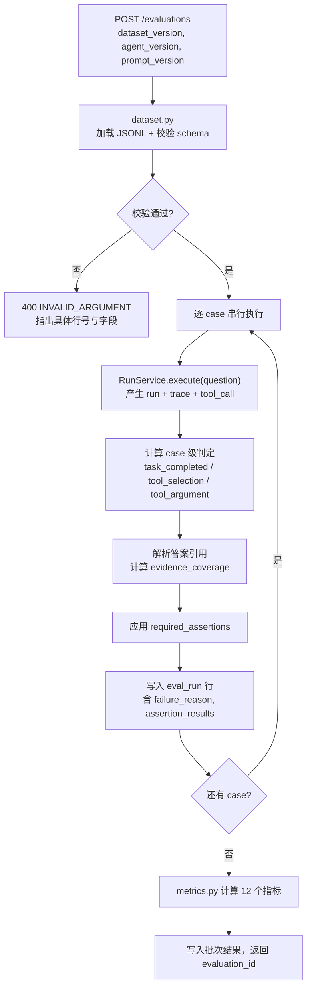

# EVALUATION.md — AgentTrace 评测方法与指标定义

## 0. 数据来源声明（强制阅读）

本项目的所有指标只有两个合法来源，**任何指标都必须标注属于哪一类**：

| `scope` | 含义 | 允许的说法 | 禁止的说法 |
|---|---|---|---|
| `offline_evaluation` | 在固定评测集上跑出的结果 | "离线评测结果"、"在 doc_research_v1 评测集上" | "线上成功率"、"生产准确率" |
| `sample_runs` | 本实例已记录的零散运行 | "样例运行结果" | "用户量"、"日均调用" |

**禁止**：编造线上用户量、商业客户、商业收益，或任何无法由本仓库内命令复现的指标。所有指标必须能用 README 中的命令重跑得到。

---

## 1. 评测集（Dataset）

### 1.1 位置与格式

- 目录：`data/eval/`
- 文件：`<dataset_version>.jsonl`，一行一个 case
- 当前版本：`doc_research_v1.jsonl`（14 个 case）

### 1.2 Case Schema

```json
{
  "case_key": "doc-001",
  "question": "AgentTrace 的 trace_event 表里 parent_event_id 的作用是什么？",
  "expected_tools": ["search_documents"],
  "expected_arguments": {
    "search_documents": {"top_k": 3}
  },
  "required_assertions": ["contains_citation", "mentions_parent_event_id"],
  "required_citations": 1,
  "expect_success": true,
  "tags": ["trace", "schema"]
}
```

| 字段 | 类型 | 必填 | 语义 |
|---|---|---|---|
| `case_key` | string | 是 | 稳定唯一 ID |
| `question` | string | 是 | 输入问题 |
| `expected_tools` | string[] | 是 | 期望被调用的工具，**有序**：顺序也参与选择正确性判定 |
| `expected_arguments` | object | 否 | 参数断言：`{tool_name: {arg_name: expected_value}}` |
| `required_assertions` | string[] | 是 | 关键断言名（见 §4） |
| `required_citations` | int | 否 | 答案最少引用数，默认 0 |
| `expect_success` | bool | 否 | 期望 run 终态是否为 `succeeded`，默认 true |
| `tags` | string[] | 否 | 分类标签 |

### 1.3 评测集的真实性声明

`doc_research_v1.jsonl` 中的问题由**本项目作者针对本仓库自建的 6 篇样例文档**编写，属于**合成评测集**。它不来自任何真实用户日志、不包含任何公司业务数据。规模小（14 case）是刻意的：目的是让每个 case 都能被人工核对。

---

## 2. 指标总览

> **编号 ≠ 指标名数量。** 下表用 **M1 ~ M10** 十个编号组织，但 M6（延迟分位数）
> 展开为 `latency_ms_p50` / `latency_ms_p95` / `latency_ms_mean` 三个独立指标名。
> 因此 `metrics` 响应里实际有 **12 个键**，`contract.lock.json` 锁定的也是这 12 个名字。
> 引用"指标数"时请说明是 **M 编号数（10）** 还是 **指标名数（12）**，
> 两者都对，混用会让人以为文档与实现不一致。

| # | 指标 | 类型 | 方向 | 数据来源 |
|---|---|---|---|---|
| M1 | `run_success_rate` | 比率 | ↑ | eval_run |
| M2 | `task_completion_rate` | 比率 | ↑ | eval_run |
| M3 | `tool_selection_accuracy` | 比率 | ↑ | eval_run + tool_call |
| M4 | `tool_argument_accuracy` | 比率 | ↑ | eval_run + tool_call |
| M5 | `evidence_coverage` | 均值 | ↑ | eval_run |
| M6 | `latency_ms_p50` / `p95` / `mean` | 分位数 | ↓ | eval_run.latency_ms |
| M7 | `total_tokens` | 计数 | — | eval_run.total_tokens |
| M8 | `estimated_cost_usd` | 金额 | ↓ | eval_run.estimated_cost_usd |
| M9 | `error_rate` | 比率 | ↓ | eval_run |
| M10 | `human_review_rate` | 比率 | ↓ | eval_run |

---

## 3. 指标计算公式

记评测集为 $C = \{c_1, \dots, c_N\}$，$N$ 为 case 数（**分母始终是评测集大小，含失败的 case**，不允许用"成功执行数"做分母，否则失败会被隐藏）。

### M1 `run_success_rate`

$$\text{run\_success\_rate} = \frac{|\{c_i : \text{status}_i = \text{succeeded}\}|}{N}$$

- **数据来源**：`eval_run.status`
- **适用范围**：离线评测；衡量 Agent 端到端能否正常完成
- **注意**：`degraded` **不计入成功**。降级不等于成功，这是刻意的严格定义
- **代码位置**：`app/evaluation/metrics.py::run_success_rate`

### M2 `task_completion_rate`

$$\text{task\_completion\_rate} = \frac{|\{c_i : \text{task\_completed}_i = \text{true}\}|}{N}$$

`task_completed` 的判定条件（**全部满足**才算完成）：

1. `run.status == "succeeded"`；
2. 答案非空（`answer_chars >= 1`）；
3. `required_assertions` 中所有断言通过；
4. 若 `expect_success = false`，则要求 run 确实失败（反向断言，用于验证失败路径）

- **数据来源**：`eval_run.task_completed`
- **适用范围**：离线评测
- **与 M1 的区别**：M1 只看状态，M2 还看内容断言。M2 ≤ M1 恒成立。若出现 M2 > M1，说明断言逻辑有 bug
- **代码位置**：`metrics.py::task_completion_rate`

### M3 `tool_selection_accuracy`

$$S_i = \text{ordered\_match}(\hat{T}_i, T^*_i)$$

$$\text{tool\_selection\_accuracy} = \frac{|\{c_i : S_i\}|}{|\{c_i : \text{expected\_tools}_i \neq \emptyset\}|}$$

其中：
- $\hat{T}_i$ = 该 case 实际调用成功的工具序列（按 `tool_call.started_at` 排序，去重保留首次出现，**排除** `invalid_arguments` 与 `skipped`）
- $T^*_i$ = `expected_tools`，**有序**
- `ordered_match`：长度相同且逐位相等

**分母说明**：仅统计"有工具期望"的 case。若某 case `expected_tools` 为空，它不参与本指标（分子分母都不计），否则会虚高准确率。

但**评测报告中必须同时给出** `tool_selection_eligible_count`，让读者知道分母大小。

- **数据来源**：`tool_call` 实时推导 + `eval_case.expected_tools`
- **适用范围**：离线评测
- **代码位置**：`metrics.py::tool_selection_accuracy`

### M4 `tool_argument_accuracy`

对每个"有参数期望"的 `(case, tool)` 对判断：

$$A_{i,t} = \bigwedge_{(a, v) \in \text{expected\_arguments}[t]} \big(\text{arg}_{i,t}[a] = v\big)$$

$$\text{tool\_argument\_accuracy} = \frac{|\{(i,t) : A_{i,t}\}|}{|\{(i,t) : t \in \text{expected\_arguments}\}|}$$

**比较语义**（必须精确实现，避免误判）：

| 期望值类型 | 比较方式 |
|---|---|
| 标量（str/int/float/bool） | 严格相等；float 允许绝对误差 `1e-9` |
| 列表 | 视为集合做无序比较（参数是标量列表时，顺序无语义） |
| 字典 | 递归逐键比较，**期望是子集**即可通过（允许实际参数有额外键） |
| `null` | 仅当实际值也为 `null` 时通过 |

- **数据来源**：`tool_call.arguments` + `eval_case.expected_arguments`
- **适用范围**：离线评测
- **前提**：只统计 `validated = true` 的调用。参数未通过 Pydantic 校验的调用直接判 `A=false`
- **代码位置**：`metrics.py::tool_argument_accuracy`

### M5 `evidence_coverage`

单 case 的覆盖度：

$$\text{cov}_i = \min\left(1.0,\ \frac{|\text{citations}_i|}{\max(1, \text{required\_citations}_i)}\right)$$

$$\text{evidence\_coverage} = \frac{\sum_i \text{cov}_i}{N}$$

- **定义**：答案给出的引用条数与要求条数之比，**上限截断为 1.0**（多引用不加分，避免用堆砌引用刷分）
- **数据来源**：`eval_run.evidence_coverage`（由答案中解析出的 `citations` 计算）
- **适用范围**：离线评测
- **注意**：这是**引用覆盖率**，不是"答案正确率"。引用存在不代表引用正确
- **代码位置**：`metrics.py::evidence_coverage`

### M6 延迟分位数

给定已排序的延迟序列 $L = [l_1 \le l_2 \le \dots \le l_N]$，采用 **nearest-rank 方法**（不插值，避免报告出观测不到的延迟值）：

$$\text{quantile}(p) = l_{\lceil p \cdot N \rceil}$$

- `latency_ms_p50` = quantile(0.50)
- `latency_ms_p95` = quantile(0.95)
- `latency_ms_mean` = $\frac{1}{N}\sum l_i$（同时报告，但不作为门禁主指标）

**边界**：$N = 0$ 时全部返回 `null`；$N = 1$ 时 p50 = p95 = 该值（**必须标注样本过小**）。

- **数据来源**：`eval_run.latency_ms`
- **适用范围**：离线评测
- **注**：使用 nearest-rank 而非线性插值，原因是在 N=12 这种小样本下，插值会产生"从未观测到"的数值，容易误导
- **代码位置**：`metrics.py::percentile`、`latency_summary`

### M7 Token 总量

$$\text{total\_tokens} = \sum_i \text{total\_tokens}_i$$

仅做算术求和，不做归一化。解读时必须同时看 `case_count`。

- **数据来源**：`eval_run.total_tokens`（其值来自 `model_call.total_tokens` 求和）
- **代码位置**：`metrics.py::token_summary`

### M8 `estimated_cost_usd`（估算成本）

单个模型调用：

$$\text{cost} = \frac{\text{prompt\_tokens}}{10^6} \cdot P_{\text{in}} + \frac{\text{completion\_tokens}}{10^6} \cdot P_{\text{out}}$$

一次性评测：

$$\text{estimated\_cost\_usd} = \sum_i \text{estimated\_cost\_usd}_i$$

**价目表**（`app/evaluation/pricing.py`，单位：USD / 1M tokens）：

| 模型 | $P_{in}$ | $P_{out}$ | 说明 |
|---|---|---|---|
| `fake-model` | 0.00 | 0.00 | 测试替身，成本恒为 0 |
| `gpt-4o-mini` | 0.15 | 0.60 | 内置参考价 |
| `gpt-4o` | 2.50 | 10.00 | 内置参考价 |
| `ollama/*` | 0.00 | 0.00 | 本地推理，按 0 计 |

**必须声明的限制**：
1. 价目表是**硬编码的参考价**，会过时；
2. 估算值**不等于真实账单**（不含缓存命中折扣、批处理折扣、阶梯价）；
3. 未知模型名 → 成本记 `0` **并在响应中加 `cost_estimation_unavailable: true` 标志**，绝不静默当 0 处理。

- **代码位置**：`pricing.py::estimate_cost`、`metrics.py::cost_summary`

### M9 `error_rate`

$$\text{error\_rate} = \frac{|\{c_i : \text{status}_i \in \{\text{failed}, \text{timeout}\}\}|}{N}$$

- **数据来源**：`eval_run.status`
- **关系**：`error_rate = 1 - run_success_rate - degraded_rate`（本项目 `degraded` 不计入 error，单独统计并报告 `degraded_rate`）
- **代码位置**：`metrics.py::error_rate`

### M10 `human_review_rate`

$$\text{human\_review\_rate} = \frac{|\{c_i : \text{run 中任一节点状态} = \text{handoff}\}|}{N}$$

- **定义**：需要人工接管的运行占比。本项目不实现人工接管 UI，`handoff` 仅表示"自动流程无法继续，需人工介入"
- **数据来源**：trace_event 中 `status = "handoff"` 的存在性
- **适用范围**：离线评测
- **代码位置**：`metrics.py::human_review_rate`

---

## 4. 断言（Assertions）目录

`required_assertions` 支持的断言名（`app/evaluation/assertions.py` 实现）：

| 断言名 | 判定 | 说明 |
|---|---|---|
| `contains_citation` | 答案中至少含 1 处 `[doc-xxx]` 形式引用 | 基础引用要求 |
| `min_citations>=N` | 引用数 ≥ N | 由 `required_citations` 或断言字符串指定 |
| `has_evidence_section` | 答案含"证据"/"依据"小节 | 结构要求 |
| `mentions_<keyword>` | 答案（大小写不敏感）含指定关键词 | 内容要求，关键字由 case 定义 |
| `no_hallucinated_doc` | 引用的所有 `doc-xxx` 都真实存在于 `data/sample_docs/` | **反幻觉**断言 |
| `status_is_succeeded` | run 终态为 `succeeded` | 与 `expect_success` 配合 |
| `status_is_failed` | run 终态为 `failed` | 用于失败路径 case |

**`no_hallucinated_doc` 是本项目最重要的断言**：它检查 Agent 是否引用了不存在的文档 ID。这是可确定性验证的，不依赖人工判断。

---

## 5. 评测执行流程



### 5.1 失败 case 必须保存的信息

契约强制：每个失败 case 必须能回答"为什么失败"。因此 `eval_run` 必须写入：

| 字段 | 内容 |
|---|---|
| `failure_reason` | 结构化原因，格式 `<category>: <detail>` |
| `assertion_results` | 每条断言的 `passed` 与 `detail` |
| `run_id` | 指向实际运行，可进一步查 Trace 定位 |

`failure_reason` 的 category 枚举：

| category | 含义 |
|---|---|
| `run_status_mismatch` | 终态与 `expect_success` 不符 |
| `tool_selection_mismatch` | 工具序列不匹配（detail 含 expected / actual） |
| `tool_argument_mismatch` | 参数不匹配（detail 含 tool、arg、expected、actual） |
| `assertion_failed` | 关键断言未通过（detail 含断言名） |
| `insufficient_citations` | 引用数不足 |
| `run_error` | run 本身失败（detail 含 error_code） |

### 5.2 版本对比

三个维度可任意组合分组：`agent_version`、`prompt_version`、`model_name`。

对比通过 `GET /metrics/summary?group_by=<dimension>` 得到各组的 12 个指标，然后逐指标看差异。

**回归判定建议**（不强制，由使用者按项目需要定义）：若新版本在 `task_completion_rate`、`tool_selection_accuracy`、`tool_argument_accuracy` 中任一指标下降超过 5 个百分点，或 `latency_ms_p95` 上升超过 30%，视为疑似回归。

---

## 6. 质量门禁（Quality Gate）

### 6.1 默认阈值

```yaml
run_success_rate:        {min: 0.90}
task_completion_rate:    {min: 0.85}
tool_selection_accuracy: {min: 0.90}
tool_argument_accuracy:  {min: 0.85}
evidence_coverage:       {min: 0.70}
latency_ms_p95:          {max: 2000}
estimated_cost_usd:      {max: 0.05}
error_rate:              {max: 0.05}
human_review_rate:       {max: 0.00}
```

### 6.2 判定逻辑

$$P = |V| = 0, \quad V = \{m : \text{violated}(m, \theta_m)\}$$

$$\text{violated}(m, \theta) = \begin{cases} \text{observed}_m < \theta.\text{min} & \text{若 } m \text{ 为比率型} \\ \text{observed}_m > \theta.\text{max} & \text{若 } m \text{ 为代价型} \end{cases}$$

$$\text{passed} = (P = \text{true}), \quad \text{blocked} = \neg P$$

### 6.3 门禁的语义边界（重要）

1. 门禁通过**仅表示满足本项目定义的离线质量基线**，不等于可生产发布；
2. 任何指标为 `null`（如无数据）时，**该指标不参与判定**，但在响应中列入 `skipped_metrics`，且**不允许**在文档中把"跳过"说成"通过"；
3. 门禁结果必须持久化到 `quality_gate` 表，含所使用的阈值快照，保证可复现判断依据。

### 6.4 退出码约定（供 CI / 脚本使用）

`scripts/run_eval.py --gate` 的退出码：

| 退出码 | 含义 |
|---|---|
| 0 | 评测完成且门禁通过 |
| 1 | 评测完成但门禁未通过（**阻断**） |
| 2 | 评测执行本身出错（数据集问题、Trace 写入失败等） |

---

## 7. 真实模型集成运行 vs 离线替身运行

这是本项目最容易被含糊处理的地方，这里**强制区分**：

| 维度 | 离线替身运行（默认） | 真实模型集成运行 |
|---|---|---|
| `LLM_PROVIDER` | `fake` | `openai` 或 `ollama` |
| 网络 | **不访问** | 访问 |
| API Key | 不需要 | 需要（仅从 env 读取） |
| `is_test_double` | `true` | `false` |
| 测试命令 | `python -m pytest tests -q` | `ENABLE_REAL_LLM_TESTS=true python -m pytest tests/integration -q` |
| 结果可信度 | 只验证**流程与逻辑正确性** | 验证真实模型行为 |
| 能否用来说明模型能力 | **不能** | 可以，但仍需标注样本量与评测集版本 |

**强制的标注要求**：

1. `Fake*` 类名与 `LLM_PROVIDER=fake` 的响应都带 `is_test_double: true`；
2. 任何由替身产生的数值，在 README / EVALUATION.md / API 响应中都必须标注；
3. **禁止**用替身跑出的 `task_completion_rate` 描述 Agent 的"智能程度"——替身只验证管道是否通；
4. 真实集成测试在 CI 中默认**不运行**（无密钥），只在本地手动开启，且必须在 README 说明。

---

## 8. 反模式清单（实现时禁止）

| 反模式 | 为什么禁止 |
|---|---|
| 用"成功执行数"做指标分母 | 会把失败 case 隐藏掉，指标虚高 |
| `degraded` 计入成功 | 降级意味着证据不足，计入成功会掩盖质量问题 |
| 用线性插值算 p95 | 小样本下产生未观测到的数值，误导读者 |
| 未知模型成本静默记 0 | 掩盖成本不可估算的事实 |
| 用固定成功结果冒充集成测试 | 直接违反契约 B5/B6 |
| 让 LLM 计算延迟/成本 | 契约 §3.3 明确要求确定性代码 |
| 指标不带 `scope` / 数据来源说明 | 违反契约 B9 |
| 门禁跳过指标后仍声称"通过" | 掩盖未验证项 |
