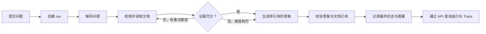

# AgentTrace 项目介绍

AgentTrace 是一个面向 LLM Agent 执行过程的可观测性与质量评测平台。系统通过五节点文档研究 Agent 串联运行记录、节点与调用追踪、重新运行、离线评测和质量门禁，形成完整的可追溯链路。

项目采用 Python、FastAPI、LangGraph、Pydantic v2 与 SQLAlchemy 2.x，提供 HTTP API、Swagger UI 和评测命令行。默认使用本地 Fake LLM，无需模型密钥即可验证流程；这些结果只说明流程与逻辑表现，不代表真实模型能力或生产效果。

## 解决的问题

| 使用场景 | 项目提供的能力 |
|---|---|
| Agent 返回错误答案，需要定位原因 | 按 run 查询节点、工具、模型调用与错误事件 |
| 工具参数不合法或调用失败 | 统一参数校验、调用记录、计时与有限重试 |
| 想复查一次历史运行 | 查询历史 Trace，或基于历史输入创建关联的新运行 |
| 希望判断一次代码或配置修改是否影响结果 | 固定 JSONL 用例，执行断言并聚合评测指标 |
| 希望给发布流程设置质量条件 | 比较指标与阈值，记录门禁结论；CLI 提供退出码 |

## 架构与模块职责

完整架构图见 [架构设计](ARCHITECTURE.md)，可编辑图源见 [system_architecture.mmd](diagrams/system_architecture.mmd)。

| 层次 | 代码入口 | 职责 |
|---|---|---|
| 接口与契约 | `app/api/`、`app/schemas/` | 请求校验、服务调用、响应与错误映射 |
| 应用服务 | `app/services/` | 运行生命周期、回放、评测批次查询、指标汇总 |
| Agent 工作流 | `app/agent/graph.py`、`app/agent/nodes/` | 五节点编排、证据不足时放宽检索、结果校验 |
| 模型适配 | `app/agent/llm.py` | Fake、OpenAI-compatible、Ollama 提供方 |
| 工具治理 | `app/tools/` | 工具注册、Pydantic 参数校验、计时、重试与追踪 |
| 可观测性 | `app/agent/middleware.py` | TraceRecorder 记录节点、调用及其关联 |
| 评测与门禁 | `app/evaluation/` | JSONL 加载、逐 case 判定、指标聚合与阈值检查 |
| 持久化 | `app/db/` | Repository、SQLAlchemy 模型与事务；评测部分直接使用 Session |
| 公共能力 | `app/core/` | 配置、标识符、结构化日志、脱敏、统一异常 |

## 一次运行如何完成

证据不足时默认允许一次放宽检索，额度耗尽后继续生成答案并标记降级；最终状态还受答案校验结果影响。问题解析与答案生成调用模型，检索节点通过注册表调用 `search_documents` 和 `get_document`。另外两个统计工具已注册，但当前五节点图没有调用它们。

Trace 使用父子事件关系组织执行过程，工具调用与模型调用还有各自的明细表。数据库包含 `agent_definition`、`run`、`trace_event`、`tool_call`、`model_call`、`eval_case`、`eval_run`、`quality_gate` 八张表。评测批次通过 `eval_run.evaluation_id` 分组，不存在独立的 evaluation 批次表。

## 评测如何形成闭环

JSONL 用例 → EvaluationRunner → RunService 执行 Agent → 对照工具、参数及答案断言 → 写入 case 结果 → 聚合 12 个指标 → 按需执行质量门禁。

指标覆盖运行成功率、任务完成率、工具选择与参数准确率、证据覆盖率、延迟 p50/p95/均值、Token 总量、估算成本、错误率和人工复核率。计算口径见 [评测说明](EVALUATION.md)。执行 `python scripts/run_eval.py --dataset doc_research_v1 --gate` 可得到门禁退出码：0 为通过，1 为门禁未通过，2 为执行错误。

## 当前实现边界

- 这是包含示例 Agent 的后端项目；尚未提供通用追踪 SDK、前端仪表盘、鉴权或多租户。
- 检索基于关键词和 6 篇合成文档，尚未接入向量数据库。
- 创建运行同步等待执行结果；没有后台任务队列，不能把线程执行描述为异步任务系统。
- 回放会重新执行并创建新 `run_id`，通过 `source_run_id` 关联原运行；它不是基于检查点恢复执行，也不保证模型输出完全复现。
- `agent_version` 与 `prompt_version` 当前主要用于记录、筛选和分组。仅修改标签不会自动切换节点代码或提示词模板；真实版本对比需要相应实现或配置变化。
- Redis 缓存类、部署配置与健康探针已实现，但当前 `RunService` 没有调用状态缓存写入接口。Redis 不是运行结果的事实来源。
- PostgreSQL 用于 Compose 部署，SQLite 用于测试。数据库尚无 Alembic 迁移流程。
- CI 会运行 Fake LLM 与合成评测集的质量门禁，可以阻断确定性流程回归；它不能证明真实模型质量或生产表现。

## 如何体验与阅读

先按 [README 快速开始](../README.md#快速开始) 启动项目，在 `/docs` 提交运行并查询事件，然后执行离线评测与门禁。阅读代码时建议依次查看 `app/api/runs.py` → `app/services/run_service.py` → `app/agent/graph.py` → `app/agent/middleware.py` → `app/evaluation/runner.py`。

准备公开仓库时，参照 [GitHub 发布准备清单](GITHUB_READINESS.md)。项目仅使用自建、公开或合成样例，不包含生产效果承诺。
