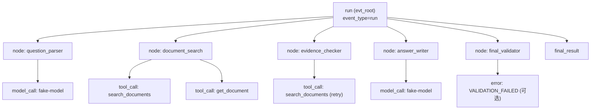

# TRACE_SCHEMA.md — AgentTrace Trace 契约

## 1. Trace 的目的

一次 Agent 运行的黑盒输出只有一个最终答案，无法回答"它怎么走到这里的"。Trace 是运行的**过程证据**，必须能支撑四类问题：

1. **查询**：这次运行做了什么？每个节点进出时间、状态、耗时？
2. **回放**：能不能用同样的输入再跑一次并对比？
3. **失败定位**：失败发生在哪个节点/工具，错误码是什么？
4. **度量**：工具选对没有、参数对不对、Token 花了多少、钱花了多少？

## 2. 事件类型（6 类，固定）

| `event_type` | 触发点 | `name` 取值 | 数量级 | 关键属性 |
|---|---|---|---|---|
| `run` | RunService 创建运行 | `run` | 每 run 1 条 | `agent_version`、`prompt_version`、`llm_provider` |
| `node` | 每个节点进入/退出 | 节点名，如 `question_parser` | 每 run 5~7 条 | `node_index`、`attempt` |
| `tool_call` | 每次工具调用 | 工具名，如 `search_documents` | 每 run 2~5 条 | `tool_name`、`validated`、`retry_count` |
| `model_call` | 每次 LLM 调用 | 模型名，如 `gpt-4o-mini` / `fake-model` | 每 run 2~4 条 | `provider`、`is_test_double`、`total_tokens` |
| `error` | 任何被捕获的失败 | 错误码，如 `TOOL_TIMEOUT` | 0~N 条 | `error_code`、`node_name`、`exception_type` |
| `final_result` | 运行终结 | `final_result` | 每 run 1 条 | `final_status`、`has_citation`、`evidence_sufficient` |

## 3. 必需字段（全部 6 类事件共有）

| 字段 | 类型 | 可为空 | 语义 |
|---|---|---|---|
| `event_id` | `string` | 否 | `evt_<ulid>`，全局唯一 |
| `run_id` | `string` | 否 | 所属 run |
| `parent_event_id` | `string \| null` | 是 | 父事件；`run` 事件与顶层 `node` 事件为 null |
| `event_type` | `string` | 否 | 6 类之一 |
| `name` | `string` | 否 | 事件名 |
| `status` | `string` | 否 | 见 §4 |
| `started_at` | `datetime(tz)` | 否 | UTC |
| `ended_at` | `datetime(tz) \| null` | 是 | 未结束时为 null |
| `duration_ms` | `int \| null` | 是 | `ended_at - started_at` 的毫秒数 |
| `input_summary` | `string \| null` | 是 | 输入摘要，已脱敏、已截断 |
| `output_summary` | `string \| null` | 是 | 输出摘要，已脱敏、已截断 |
| `error_code` | `string \| null` | 是 | 失败错误码 |

附加非必需字段：`sequence`（同 run 内单调递增）、`attributes`（JSON 扩展）。

## 4. 状态语义

| `status` | 含义 | 什么时候写入 |
|---|---|---|
| `pending` | 已创建未开始 | 预留，当前实现中节点级不使用 |
| `running` | 进行中（`ended_at` 仍为 null） | 事件 INSERT 时 |
| `ok` | 正常结束 | 事件 UPDATE 补 `ended_at` 时 |
| `failed` | 执行失败 | 捕获异常后 |
| `skipped` | 按策略跳过（如证据已足够，不再放宽检索） | 条件边判定跳过时 |
| `retried` | 本事件是重试产生的（父事件标记 `failed`） | 重试路径 |
| `invalid_arguments` | 工具参数未通过 Pydantic 校验 | 工具注册表校验失败时 |
| `handoff` | 需要人工接管，自动流程停止 | 自动重试耗尽且无法降级时 |

**`handoff` 的语义边界**：本项目不实现人工接管 UI。`handoff` 表示"自动流程到此为止，已记录足够证据供人工介入"，run 的最终状态为 `failed`（而非 `succeeded`），并在 README 已知限制中说明。

## 5. 父子关系（树形结构）



规则：
1. `parent_event_id` 必须指向**同一 `run_id`** 的事件（跨 run 引用非法）；
2. 只有 `node`、`final_result` 可以直接挂在 `run` 事件下；
3. `tool_call` 与 `model_call` 必须挂在发起它们的 `node` 事件下；
4. `error` 可以挂在 `node`、`tool_call`、`model_call` 之下（取其 `event_id` 作为 `parent_event_id`）；
5. 不允许环形引用（由 `sequence` 单调递增保证）。

## 6. `sequence` 与回放

`sequence` 是同一 `run_id` 内的整数，从 1 开始，每次写入新事件时 `max(sequence) + 1`。

用途：Trace 按 `sequence` 排序即为**确定的执行顺序**。回放对比时，以 `sequence` 对齐两次运行的同位置事件，避免按时间戳排序时因毫秒精度相同导致的顺序抖动。

约束：`UNIQUE(run_id, sequence)`。

## 7. 摘要与脱敏规则（强制）

### 7.1 截断

`input_summary` / `output_summary` / `result_summary` / `validation_error` / `failure_reason` / `error_message` 一律经过 `core/redaction.py::summarize()`：

1. 输入转为紧凑 JSON 字符串（`ensure_ascii=False`，无多余空格）；
2. 应用正则脱敏（§7.2）；
3. 若长度 > `SUMMARY_MAX_CHARS`（默认 500），截断为前 `SUMMARY_MAX_CHARS - 20` 字符 + `...[truncated:{原长度}]`。

### 7.2 脱敏模式

| 模式 | 匹配 | 替换 |
|---|---|---|
| OpenAI Key | `sk-[A-Za-z0-9_\-]{16,}` | `[REDACTED_API_KEY]` |
| Bearer Token | `(?i)bearer\s+[A-Za-z0-9._\-]{12,}` | `[REDACTED_BEARER]` |
| 通用 api_key 赋值 | `(?i)(api[_-]?key\|token\|secret\|password)\s*[:=]\s*["']?[^\s"',}]{6,}` | `\1=[REDACTED]` |
| 连接串口令 | `://[^:/@\s]+:[^@/\s]+@` | `://[REDACTED_CREDENTIALS]@` |
| 国内手机号 | `(?<!\d)1[3-9]\d{9}(?!\d)` | `[REDACTED_PHONE]` |
| 邮箱 | `[\w.+-]+@[\w-]+\.[\w.]{2,}` | `[REDACTED_EMAIL]` |

### 7.3 不落库的内容（硬性禁止）

以下内容**任何情况下**不写入数据库或日志：

1. `LLM_API_KEY` 或其任何前缀/后缀片段；
2. 完整 System Prompt 与完整 User Prompt（只存摘要）；
3. 数据库连接串中的口令（连接串本身允许出现在日志的启动信息中，但必须过 `://user:***@host` 形式脱敏）；
4. 完整的模型原始响应体（只存摘要与 Token 数）。

## 8. 一个完整的 Trace 样例

一次成功运行（`LLM_PROVIDER=fake`）的 `GET /runs/{run_id}/events` 响应（简化）：

```json
{
  "run_id": "run_01J8ZQ4K7X2M9P3T5V6W8Y0B1C",
  "count": 9,
  "events": [
    {
      "event_id": "evt_01J8ZQ4K800000000000000001", "sequence": 1,
      "parent_event_id": null, "event_type": "run", "name": "run",
      "status": "ok", "started_at": "2026-09-22T04:00:00.000Z",
      "ended_at": "2026-09-22T04:00:00.412Z", "duration_ms": 412,
      "input_summary": "{\"question\":\"AgentTrace 如何记录工具调用?\"}",
      "output_summary": null, "error_code": null,
      "attributes": {"agent_version": "v1", "prompt_version": "prompt-v1", "llm_provider": "fake"}
    },
    {
      "event_id": "evt_01J8ZQ4K800000000000000002", "sequence": 2,
      "parent_event_id": "evt_01J8ZQ4K800000000000000001",
      "event_type": "node", "name": "question_parser",
      "status": "ok", "started_at": "2026-09-22T04:00:00.010Z",
      "ended_at": "2026-09-22T04:00:00.098Z", "duration_ms": 88,
      "input_summary": "{\"question\":\"AgentTrace 如何记录工具调用?\"}",
      "output_summary": "{\"intent\":\"explain\",\"keywords\":[\"trace\",\"tool_call\"],\"needs_search\":true}",
      "error_code": null, "attributes": {"node_index": 1}
    },
    {
      "event_id": "evt_01J8ZQ4K800000000000000003", "sequence": 3,
      "parent_event_id": "evt_01J8ZQ4K800000000000000002",
      "event_type": "model_call", "name": "fake-model",
      "status": "ok", "started_at": "2026-09-22T04:00:00.020Z",
      "ended_at": "2026-09-22T04:00:00.095Z", "duration_ms": 75,
      "input_summary": "{\"node\":\"question_parser\",\"prompt_chars\":312}",
      "output_summary": "{\"parsed\":true}",
      "error_code": null,
      "attributes": {"provider": "fake", "is_test_double": true, "prompt_tokens": 78, "completion_tokens": 42, "total_tokens": 120}
    },
    {
      "event_id": "evt_01J8ZQ4K800000000000000004", "sequence": 4,
      "parent_event_id": "evt_01J8ZQ4K800000000000000001",
      "event_type": "node", "name": "document_search",
      "status": "ok", "started_at": "2026-09-22T04:00:00.099Z",
      "ended_at": "2026-09-22T04:00:00.150Z", "duration_ms": 51,
      "input_summary": "{\"keywords\":[\"trace\",\"tool_call\"],\"top_k\":3}",
      "output_summary": "{\"hits\":3,\"top_score\":0.81}",
      "error_code": null, "attributes": {"node_index": 2}
    },
    {
      "event_id": "evt_01J8ZQ4K800000000000000005", "sequence": 5,
      "parent_event_id": "evt_01J8ZQ4K800000000000000004",
      "event_type": "tool_call", "name": "search_documents",
      "status": "ok", "started_at": "2026-09-22T04:00:00.105Z",
      "ended_at": "2026-09-22T04:00:00.148Z", "duration_ms": 43,
      "input_summary": "{\"query\":\"trace tool_call\",\"top_k\":3}",
      "output_summary": "{\"hits\":3,\"doc_ids\":[\"doc-trace-schema\",\"doc-architecture\",\"doc-api-contract\"]}",
      "error_code": null,
      "attributes": {"tool_name": "search_documents", "validated": true, "retry_count": 0}
    },
    {
      "event_id": "evt_01J8ZQ4K800000000000000006", "sequence": 6,
      "parent_event_id": "evt_01J8ZQ4K800000000000000001",
      "event_type": "node", "name": "evidence_checker", "status": "ok",
      "started_at": "2026-09-22T04:00:00.151Z", "ended_at": "2026-09-22T04:00:00.180Z",
      "duration_ms": 29,
      "input_summary": "{\"hits\":3,\"required\":1}",
      "output_summary": "{\"sufficient\":true,\"coverage\":0.75}",
      "error_code": null, "attributes": {"node_index": 3}
    },
    {
      "event_id": "evt_01J8ZQ4K800000000000000007", "sequence": 7,
      "parent_event_id": "evt_01J8ZQ4K800000000000000001",
      "event_type": "node", "name": "answer_writer", "status": "ok",
      "started_at": "2026-09-22T04:00:00.181Z", "ended_at": "2026-09-22T04:00:00.301Z",
      "duration_ms": 120,
      "input_summary": "{\"evidence\":3}",
      "output_summary": "{\"answer_chars\":486,\"citations\":2}",
      "error_code": null, "attributes": {"node_index": 4}
    },
    {
      "event_id": "evt_01J8ZQ4K800000000000000008", "sequence": 8,
      "parent_event_id": "evt_01J8ZQ4K800000000000000001",
      "event_type": "node", "name": "final_validator", "status": "ok",
      "started_at": "2026-09-22T04:00:00.302Z", "ended_at": "2026-09-22T04:00:00.330Z",
      "duration_ms": 28,
      "input_summary": "{\"has_citation\":true}",
      "output_summary": "{\"valid\":true,\"errors\":[]}",
      "error_code": null, "attributes": {"node_index": 5}
    },
    {
      "event_id": "evt_01J8ZQ4K800000000000000009", "sequence": 9,
      "parent_event_id": "evt_01J8ZQ4K800000000000000001",
      "event_type": "final_result", "name": "final_result", "status": "ok",
      "started_at": "2026-09-22T04:00:00.331Z", "ended_at": "2026-09-22T04:00:00.331Z",
      "duration_ms": 0,
      "input_summary": null,
      "output_summary": "{\"final_status\":\"succeeded\",\"has_citation\":true,\"evidence_sufficient\":true}",
      "error_code": null, "attributes": {"total_tokens": 340, "estimated_cost_usd": 0.000187}
    }
  ]
}
```

> 上述 `duration_ms`、Token 与成本数值为**样例运行结果**，由 `LLM_PROVIDER=fake` 的本地替身产生，不代表任何真实模型或线上表现。

## 9. 失败运行的 Trace 形态

失败时 Trace **必须仍然完整可读**，且明确标出失败点：

1. 失败节点的事件 `status = "failed"`，`error_code` 非空，`output_summary` 记录失败上下文；
2. 在其下追加一条 `event_type = "error"` 的事件，`name` 为错误码，`attributes.exception_type` 记录异常类名；
3. 若触发了重试，重试事件 `status` 先为 `failed` 再追加 `status = "retried"` 的事件（`attributes.retry_count` 递增，`parent_event_id` 指向首次事件）；
4. run 的 `status` 取终态（`failed` / `timeout` / `degraded`），并在 `final_result` 事件中体现。

**禁止**：失败时只写一条 `error` 事件而不更新节点状态；禁止把失败 run 的 `status` 写成 `succeeded`。
